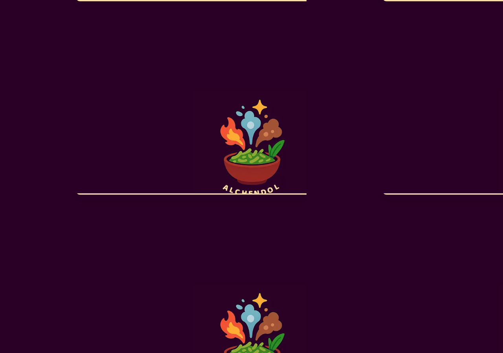
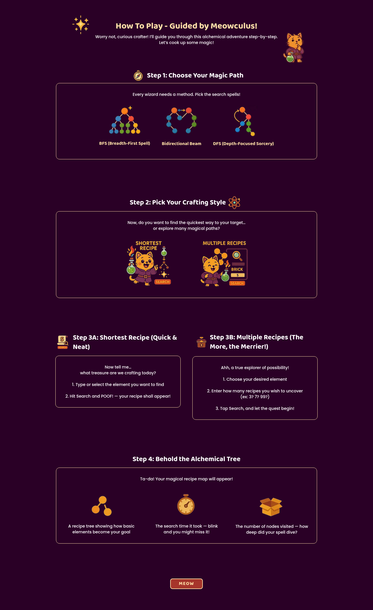
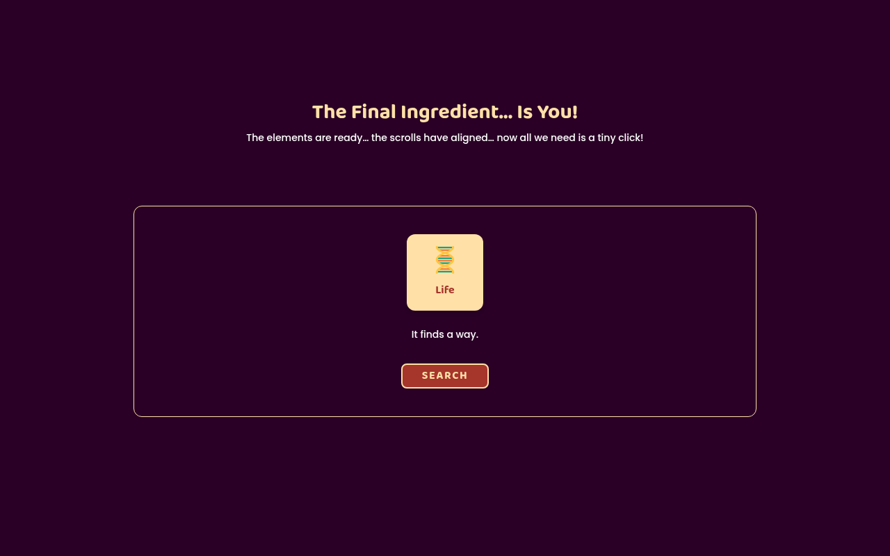
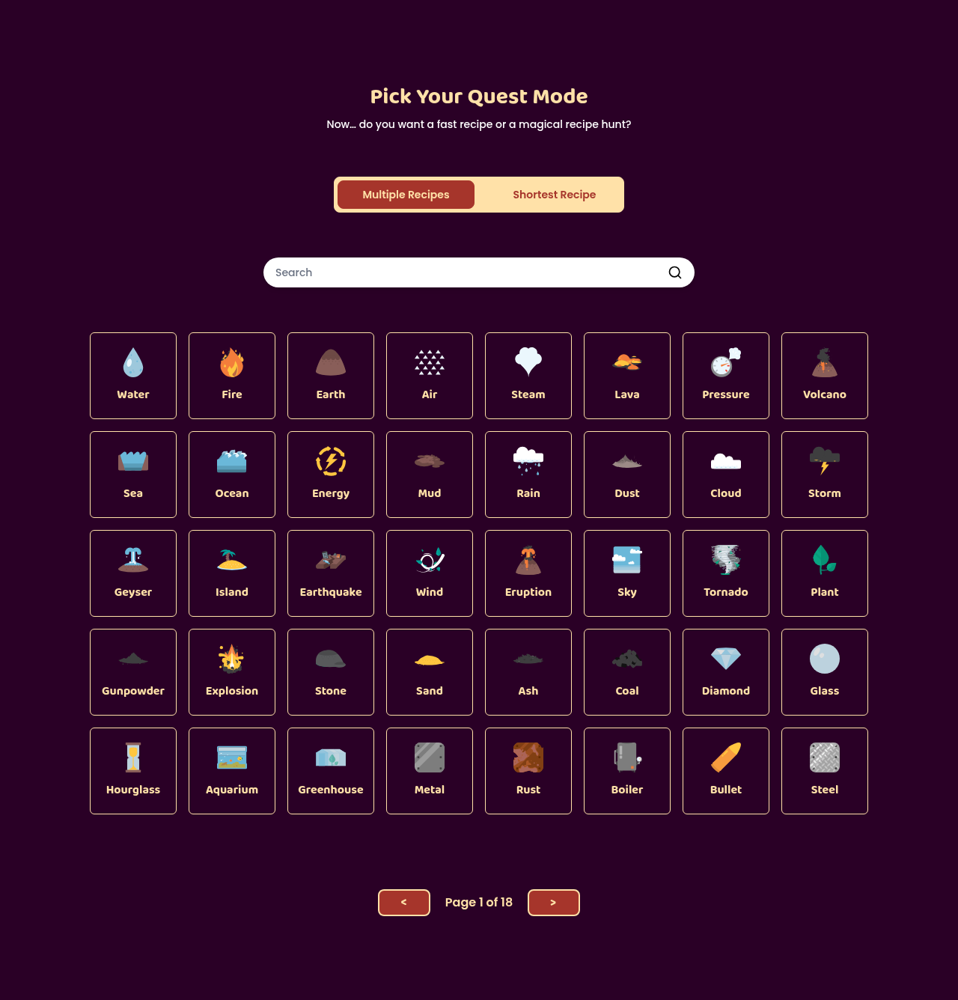
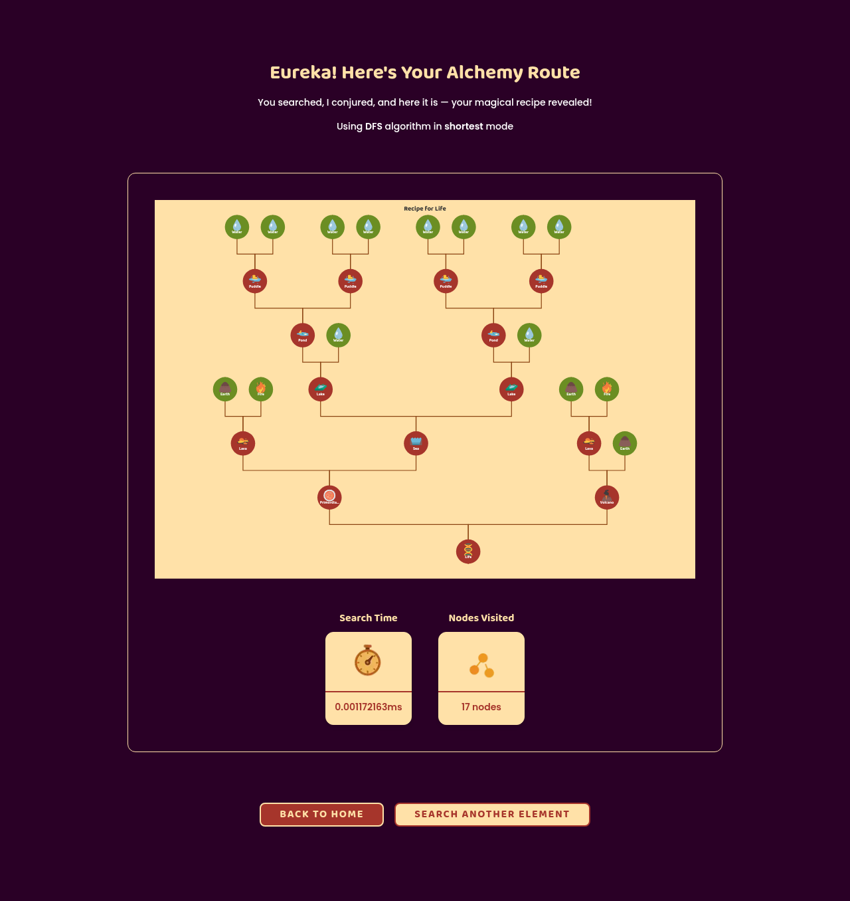
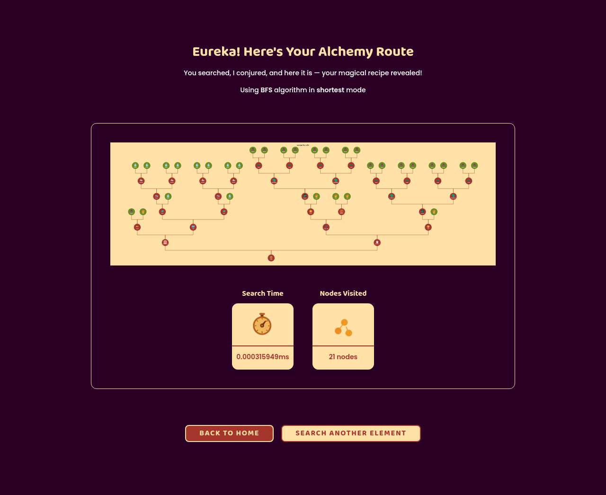

<a id="readme-top"></a>


<br/>

<div align="center">
  
  <h3 align="center">Alchendol</h3>
  <p align="center">
    Pencarian Recipe pada Little Alchemy 2 dengan Algoritma BFS dan DFS<br/>
    IF2211 — Strategi Algoritma<br/>
    Institut Teknologi Bandung
  </p>
</div>

<div align="center">
<br/>


</div>

---

<!-- TABLE OF CONTENTS -->
<details>
  <summary>Daftar Isi</summary>
  <ol>
    <li><a href="#about-the-project">Tentang Aplikasi</a></li>
    <li><a href="#tech-stack">Tech Stack</a></li>
    <li><a href="#features">Fitur Aplikasi</a></li>
    <li><a href="#getting-started">Getting Started</a></li>
    <li><a href="#screenshots">Screenshot Aplikasi</a></li>
    <li><a href="#author">Author</a></li>
  </ol>
</details>

---

## Tentang Aplikasi

<a id="about-the-project"></a>

<div align="center">
  
</div>

Program ini menyelesaikan permasalahan pencarian recipe pada permainan **Little Alchemy 2** menggunakan algoritma **Breadth-First Search (BFS)**, **Depth-First Search (DFS)**, dan **Bidirectional Search**. 
Pemain dapat mencari recipe untuk membentuk elemen tertentu dari elemen dasar yang tersedia, yaitu **water, fire, earth, air**. Program juga mendukung pencarian banyak recipe (multiple recipes) dengan optimasi multithreading.

Aplikasi berbasis web ini memvisualisasikan recipe yang ditemukan dalam bentuk tree yang interaktif. Selain itu, pengguna dapat memilih algoritma pencarian (BFS, DFS, atau Bidirectional) dan mode pencarian (Single Recipe atau Multiple Recipes) secara langsung melalui antarmuka aplikasi.

<div align="right"><a href="#readme-top">↖ Kembali ke atas</a></div>

---

## Tech Stack

<a id="tech-stack"></a>

| Kategori | Teknologi |
|:---|:---|
| **Frontend** | React.js, Next.js |
| **Backend** | Golang |
| **Styling** | Tailwind CSS |
| **Deployment** | Docker, Docker Compose |

<div align="right"><a href="#readme-top">↖ Kembali ke atas</a></div>

---

## Fitur Aplikasi

<a id="features"></a>

- **Pilihan Algoritma Pencarian:** BFS, DFS, dan Bidirectional Search.
- **Single Recipe Search:** Mencari rute terpendek / tercepat untuk membentuk suatu elemen.
- **Multiple Recipes Search:** Mencari banyak kemungkinan rute resep sekaligus.
- **Multithreading:** Optimasi pencarian pada mode Multiple Recipes menggunakan goroutines.
- **Visualisasi Tree Interaktif:** Menampilkan langkah-langkah penciptaan elemen dalam bentuk diagram tree.
- **Live Update:** Menampilkan proses pencarian secara real-time.
- **Docker Support:** Kontainerisasi penuh untuk frontend dan backend mempermudah deployment.

<div align="right"><a href="#readme-top">↖ Kembali ke atas</a></div>

---

## Getting Started

<a id="getting-started"></a>

### 🐳 Cara Menjalankan dengan Docker (Rekomendasi)

Jika Anda tidak ingin menginstal Node.js dan Go secara manual, Anda dapat menjalankan seluruh aplikasi dengan Docker:

1. Pastikan Docker dan Docker Compose sudah terpasang.
2. Buka terminal di direktori root proyek (`Tubes2_alchendol`).
3. Jalankan perintah berikut:
   ```bash
   docker compose up -d --build
   ```
4. Buka [http://localhost:3000](http://localhost:3000) di browser Anda untuk mengakses aplikasi. Backend berjalan di `http://localhost:8080`.
5. Untuk menghentikan container, jalankan:
   ```bash
   docker compose down
   ```

### ⚙️ Cara Menjalankan Manual

Jika Anda lebih memilih menjalankan secara manual (Development mode):

**1. Jalankan Backend (Golang)**
```bash
cd Tubes2_alchendol/src/backend
go run main.go
```

**2. Jalankan Frontend (Next.js)**
Buka tab terminal baru:
```bash
cd Tubes2_alchendol/src/frontend
npm install
npm run dev
```

**3. Akses Aplikasi**
Buka [http://localhost:3000](http://localhost:3000) di browser.

<div align="right"><a href="#readme-top">↖ Kembali ke atas</a></div>

---

## Screenshot Aplikasi

<a id="screenshots"></a>

<div align="center">

*Catatan: Letakkan screenshot dengan nama file yang sesuai di dalam folder `screenshots/` agar muncul di bawah ini.*

### Main Pages

| Home / Landing Page | How to Play |
|:---:|:---:|
|  |  |

### Search & Recipes

| Single Recipe Search | Multiple Recipes Search |
|:---:|:---:|
|  |  |

### Result Visualization

| Tree Diagram Result | Statistics |
|:---:|:---:|
|  |  |

</div>

<div align="right"><a href="#readme-top">↖ Kembali ke atas</a></div>

---

## Author

<a id="author"></a>

| No | Nama | NIM |
|:---:|:---|:---|
| 1 | Muhammad Alfansya | 13523005 |
| 2 | M Hazim R Prajoda | 13523009 |
| 3 | Adinda Putri | 13523071 |

<div align="right"><a href="#readme-top">↖ Kembali ke atas</a></div>
